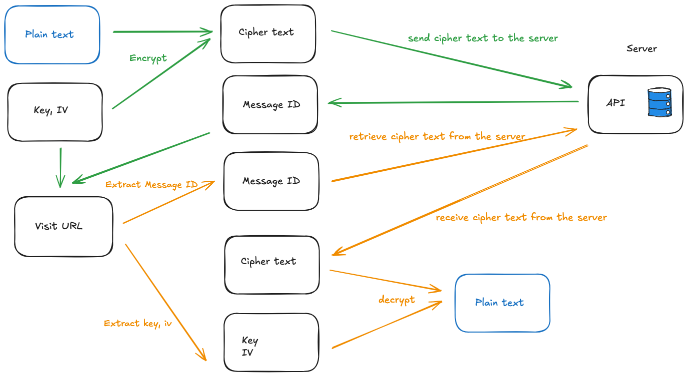

# SecureBin

A simple application for sharing text securely with client side encryption. Currently it encrypt the message with AES-GCM.

## How it works



## Usage

Download the binary from [Releases](https://github.com/zhangyuan/securebin/releases).

Start the server:

```bash
securebin server -l :8080
```

Open <http://localhost:8080> in the browser.
